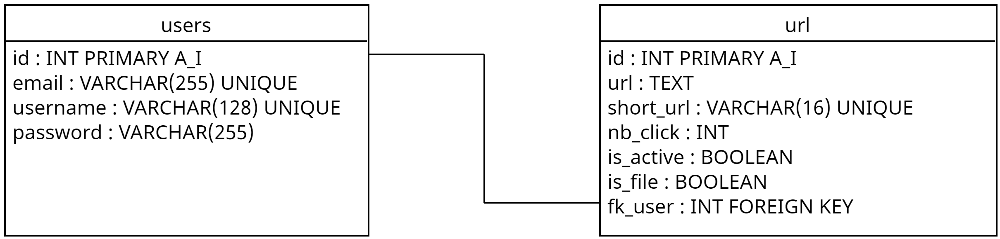

# URL Shortener

Url Shortener is a website which let you, if you're logged or not, to shorten your url, and, if you're logged in, you have the right to save it & share with your friends.

    
<b>SPOILER</b>

    
    The Upload / Download system works too 🙂

## MySQL Database

For demo, I left a folder, named `database`, which contain a zip folder to create the database in PhpMyAdmin with a default user called `test` with one url saved to test our functionalities.

## Tables relationship

## Configuration of PDO

To configure your PDO to communicate with your database. Put your config in `config/database_example_conf.php` and, once done, rename the file `database.conf.php`.
Our project works on Nginx and Apache.

### Logs

We have a log system. So, if you have an error, go to `logs/` to find it.

# Hope you like it !

Enjoy ✨

By Team #6 ✨✨✨ :

- BARTHE Simon
- CUSMA Vincenzo
- DORIATH Arthus
